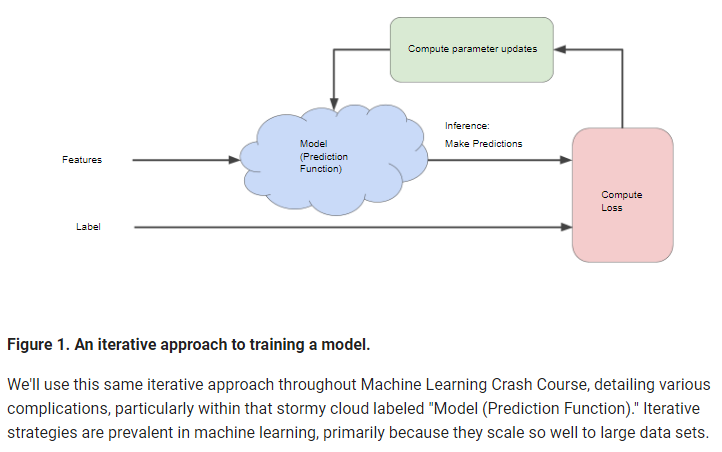

# Descending into ML: Linear Regression

[An example of simple linear regression](https://developers.google.com/machine-learning/crash-course/descending-into-ml/linear-regression)


### Training and Loss

Training means determing good values for all the weights and bias from labeled examples. 

Loss shows how bad the obersavtion is against the predicted value on an example. 

How to calculate loss:
Mean square error (MSE) is the average squared loss per example

Squared Loss: 
```
= the square of the difference between the label and the prediction 
= (observation - prediction(x))2   
= (y - y')2 
```


# Reducing Loss

__An Iterative Approach__



**Key Point:**
A Machine Learning model is trained by starting with an initial guess for the weights and bias and iteratively adjusting those guesses until learning the weights and bias with the lowest possible loss.

__Gradient Descent__
Convex problems have only one minimum; that is, only one place where the slope is exactly 0. That minimum is where the loss function converges.

First pick a starting point ie w1
Then calculate the derivative of the curve, it will then tell you which way to go depending on its negative value. 

The math behind it:


This diagram explains how to use the negative gradient to find the loss function.


# First Steps with TF

__Pseudocode for linear classification__

```
import tensorflow as tf

# Set up a linear classifier.
classifier = tf.estimator.LinearClassifier(feature_columns)

# Train the model on some example data.
classifier.train(input_fn=train_input_fn, steps=2000)

# Use it to predict.
predictions = classifier.predict(input_fn=predict_input_fn)

```

# Generalization

An overfit model gets a low loss during training but does a poor job predicting new data.

An Example of a model overfitting data:


The Blue dots over an orange surface area means it has made an incorrect prediction/classifiaction and vice versa for the orange dots.


#### Look at how to debunk a method or theory:

**The ML fine print**

The following three basic assumptions guide generalization:

- We draw examples independently and identically (i.i.d) at random from the distribution. In other words,
 examples don't influence each other. (An alternate explanation: i.i.d. is a way of referring to the 
 randomness of variables.)

- The distribution is stationary; that is the distribution doesn't change within the data set.

- We draw examples from partitions from the same distribution.

In practice, we sometimes violate these assumptions. For example:
- Consider a model that chooses ads to display. The i.i.d. assumption would be violated if 
the model bases its choice of ads, in part, on what ads the user has previously seen.

- Consider a data set that contains retail sales information for a year. 
User's purchases change seasonally, which would violate stationarity.

