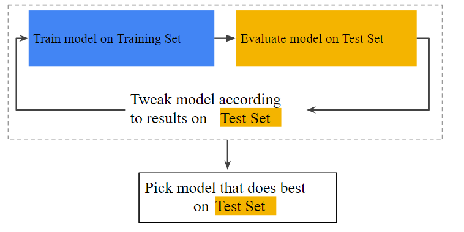
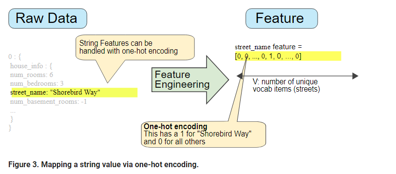
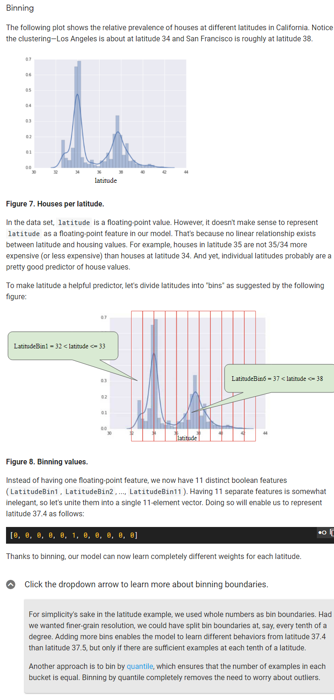

# Training and Test Sets

If you ever get 100% for your loss function. MAKE sure you have not being training on your test data.

It is when you go from Trainning and Test/Validation that you spot for overfitting. 


# Validation
You need to partition the data into a test set.



New workflow


Where does this model store its data about Loss and how to train its data accurately?


# Representation
## Feature Engineering

We need to be able to feed our model's features into a binary vector. eg Name ==> [0,0,1,0]

How do we map string values:
1. First define a vocab of all features string values to rep. 
2. Then use this vocab to create one-hot encoding to show the string as a binary vector. 




**Mapping categorical (enumerated) values**
Categorical features have a discrete set of possible values. For example, a feature called Lowland Countries would consist of only three possible values:

{'Netherlands', 'Belgium', 'Luxembourg'}

You might be tempted to encode categorical features like Lowland Countries as an enumerated type or as a discrete set of integers representing different values. 

For example:
represent Netherlands as 0
represent Belgium as 1
represent Luxembourg as 2

However, machine learning models typically represent each categorical feature as a separate Boolean value. For example, Lowland Countries would be represented in a model as three separate Boolean features:
```
x1: is it Netherlands?
x2: is it Belgium?
x3: is it Luxembourg?

```
Encoding this way also simplifies situations in which a value can belong to more than one category (for example, "borders France" is true for both Belgium and Luxembourg).


## Qualities of Good Features
- Avoid rarely used discrete feature values
- Don't mix "magic" values with actual data
- Definition of a feature should not change 

## Cleaning Data
**Scaling feature values**
Scaling means converting floats from natural range into standard range. 
```
If feature > 1 {
We are now presented with a several benefits:

Gradient descent converges quickly.
Avoids NaN trap ( Casdeces NaN to all of its child math functions)
Learns right weights of models features. 

} else {

return "Do not scale values"
}

```
One obvious way to scale numerical data is to linearly map [min value, max value] to a small scale, such as [-1, +1].
Another popular scaling tactic is to calculate the Z score of each value. The Z score relates the number of standard deviations away from the mean. In other words:


For example, given:
```
mean = 100
standard deviation = 20
original value = 130

then:
scaled_value = (130 - 100) / 20   
scaled_value = 1.5
```
Scaling with Z scores means that most scaled values will be between -3 and +3, but a few values will be a little higher or lower than that range.


Handling extreme outliers




