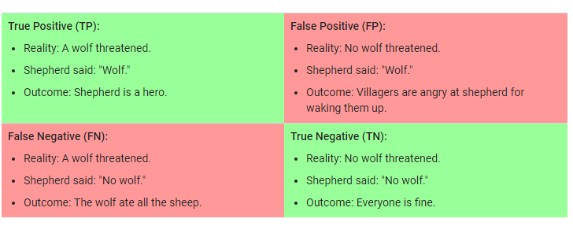

Logistic Regression

The loss function is Log Loss. While L2 regularization and early stopping (Limiting trainning steps/learning rate) are used to dampen the model's complexity. 
Ultimately it generates probabilities. 

Classification

Thresholding -
when working with logistic regression we need to be certain to define a classification threshold. 

True vs. False and Positive vs. Negative

Accuracy

Accuracy tells us the how well the model is doing to a certain extent. When working with a class-imbalanced data set we need to look at other metrics to understand what is going on. 

precision tells us what proportion of postive ids were actually correct. tp/tp+fp
eg: when a model predicts a tumor is malignant it is correct 50% of the time. [flagged as malignant tumor]

recall tells us what proportion of actual postives were correctly identified.  tp/tp+fn
eg: a model can correctly identify 11%  of malignant tumors [Actual malignant tumor]

ROC curve

It shows the performance of the classification model at all thresholds. IT has the TRUE POSTIVIE RATE VS FALSE POSITIVE RATE

TPR = tp/tp+fn 
FPR = fp/fp+tn

AUC: Area Under the ROC Curve
One way of interpreting AUC is as the probability that the model ranks a random positive example more highly than a random negative example.

AUC has benefits in certain situations:

Scale-invariant : Measures how well predictions are ranked.
Classification-threshold-invariant: Measures the quilty f thr models predictions

however: Scale invariance is not always desirable. Classification-threshold invariance is not always desirable

Prediction bias - "average of predictions" should ≈ "average of observations". Prediction bias measures how far apart those averages are. 

Possible root causes of prediction bias are:
Incomplete feature set
Noisy data set
Buggy pipeline
Biased training sample
Overly strong regularization